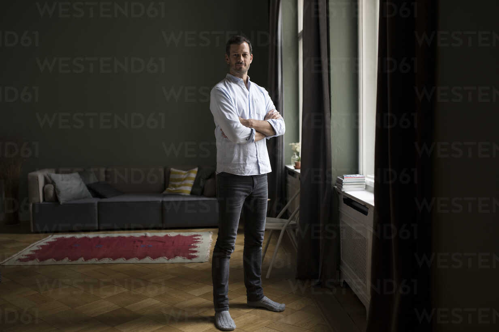

<table style="width:100%">
  <tr>    
    <th>Input Image</th>
    <th>Result</th>
    <th>Height, Waist_Width</th>
  </tr>
  <tr>    
    <td></td>    
    <td></td>
    <td>180cm, 32.72cm</td>    
  </tr>
</table>


# BodyMeasurementAI
This project leverages the <a href='https://github.com/LeCongThuong/U2Net'>U2Net model</a> to segment the human body from images and accurately extract its dimensions. 
By calibrating the camera to determine the body's distance, the system ensures precise measurements. 
Combining advanced AI-powered segmentation with distance-based calibration, this tool provides a reliable solution for estimating human body dimensions from simple images.

# Calibration Process
The system requires initial calibration using a reference subject of known height standing in a fixed position relative to the camera. This reference measurement establishes a pixel-to-real-world ratio by analyzing the segmented body dimensions from the U2Net model output. 
The fixed position ensures consistent camera perspective and depth, allowing calculation of scaling factors that account for distance-related size variations. 
Once calibrated, any subsequent subject standing in the same position can have their height and body proportions accurately determined through proportional pixel analysis of the AI-segmented silhouette, maintaining measurement consistency across different individuals without requiring additional distance sensors.

Alternatively, if the scaling factor has already been calculated, it can be set during the initialization phase of the measurer, allowing to bypass the calibration process and proceed directly to the calculations.

# Usage Example
```py
import U2Net

# INITALIZATION (the resize factor bypasses the calibration process, no need to set it if you're going to calibrate)
measurer = BodyMeasurer(resize_factor=0.0951, out_dir='out/')

# CALIBRATION
measurer.calibrate('data/test.jpg', body_height=180)

# SET THE BODY TO MEASURE
measurer.set_body('data/test.jpg')

# GET DIMENSIONS
print(f'height: {measurer.get_body_height()}cm')
print(f'waist: {measurer.get_body_width(level=0.45)}cm')

# ADDON: DRAW ELLIPSE
measurer.draw_markers(level=0.45)
```


# DEMO
<table style="width:100%">
    <tbody>
      <tr>
        <td>Input Image</td>
        <td></td>
      </tr>
      <tr>
        <td>Subject Mask</td>
        <td></td>
      </tr>
      <tr>        
        <td>Result</td>
        <td></td>
      </tr>
      <tr>
        <td>Height</td>
        <td>180cm</td>
      </tr>
      <tr>
        <td>Waist Width</td>
        <td>32.72cm</td>
      </tr>
    </tbody>
  
</table>

# CITATION
```
@InProceedings{Qin_2020_PR,
author = {Qin, Xuebin and Zhang, Zichen and Huang, Chenyang and Dehghan, Masood and Zaiane, Osmar and Jagersand, Martin},
title = {U^2-Net: Going Deeper with Nested U-Structure for Salient Object Detection},
booktitle = {Pattern Recognition},
year = {2020}
}
```


